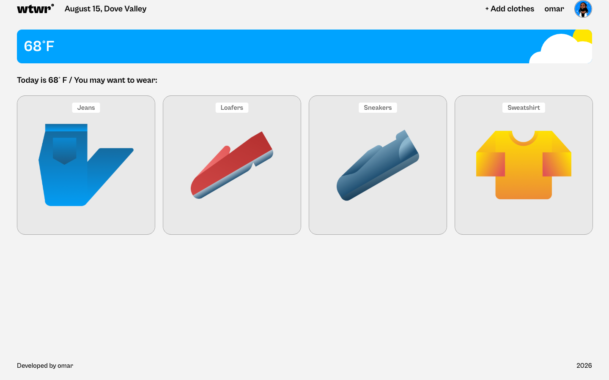
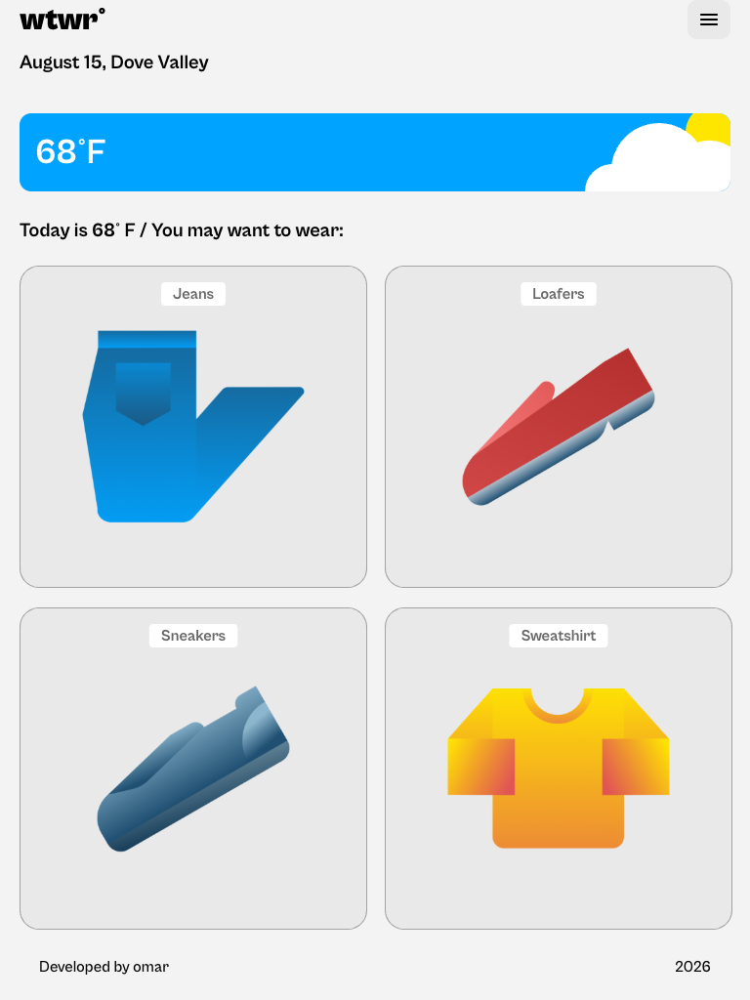
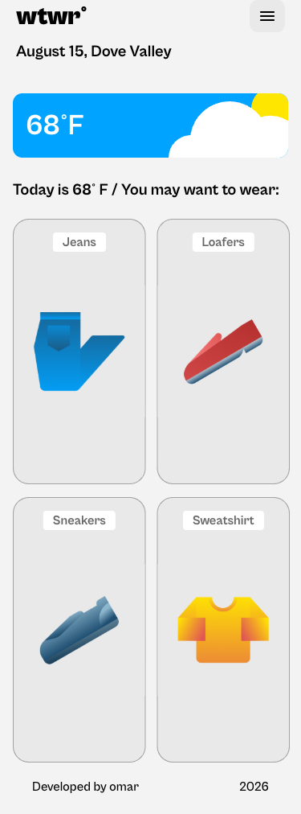

# WTWR (What to Wear?)

## About the project

The idea of the application is pretty simple - we make a call to an API, which then responds with the daily weather forecast. We collect the weather data, process it, and then based on the forecast, we recommend suitable clothing to the user.

The weather card adapts to the live conditions: it switches between day and night backgrounds and between weather states (sunny, cloudy, rain, snow, storm, fog). The app resolves the visitor's location with the Geolocation API (falling back to New York) and shows the matching city name.

## Technologies

- **React 18** — functional components and hooks (`useState`, `useEffect`)
- **Vite** — build tooling and dev server
- **OpenWeather API** — live weather data (temperature, condition, sunrise/sunset)
- **Geolocation API** — resolves the user's location with a fallback
- **ES Modules** — modern JavaScript module system
- **Prettier** — code formatting

## Screenshots

| Desktop | Tablet | Mobile |
| --- | --- | --- |
|  |  |  |

## Getting started

1. Install dependencies:

   ```bash
   npm install
   ```

2. Create an environment file from the example and add your OpenWeather API key:

   ```bash
   cp .env.example .env
   ```

   Then edit `.env` and set `VITE_OPENWEATHER_API_KEY` to your key from [openweathermap.org](https://openweathermap.org/).

3. Start the dev server (runs on port 3000):

   ```bash
   npm run dev
   ```

## Project structure

- `src/components/` — one folder per component, each with its `.jsx` and `.css`
- `src/utils/` — clothing items, coordinates, and the weather API helpers
- `src/vendor/` — `normalize.css`, fonts, and font styles
- `public/images/` — item and weather-card graphics

## Links

- [Figma Design](https://www.figma.com/file/DTojSwldenF9UPKQZd6RRb/Sprint-10%3A-WTWR)
